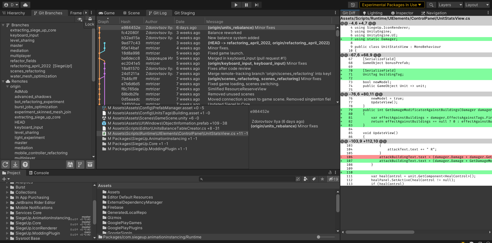

**This package is provided "as is" without any warranty, and the author and contributors will not be liable for any damages arising from its use. Use at your own risk!**

## Installation ##
Tested with Git 2.38.1 + Unity 2021.3.10f1
1. Install git client first https://git-scm.com/downloads. **I also highly recommend installing GCM** (should be installed automatically on Windows), it will show an auth window when you try to pull or push without authorization. **Git should be added to PATH** environment variable. Restart Unity and Unity Hub after you install Git and add it to PATH.
2. Window -> Package Manager -> "+" -> Add package from git URL -> https://github.com/mrtrizer/MRUnityGitUI.git
3. (Optional, Only Mac/Linux/Win on NTFS) You can link MRGitUI without adding to manifest! Just right click on MRGitUI in Project Browser -> Git -> Link Local Repo, it will suggest you clone the repo, click "Clone", after it will be linked to your Packages dir.

## How to use ##
1. Prepare layout. **Window -> Git UI -> Select window you want -> Drag somewhere**. Do this for every window.
2. When you select Directory in Project Browser, the state of related git repo will be displayed in Git UI windows respectively.
3. In the **Branches** window you can lock selected packages by clicking **"Lock"** button in the top panel, so, you won't need to select packages again, useful if you have tons of packages.
4. **Branches** window also has a bottom panel with quick access buttons to **Fetch/Pull/Push** and **Staging/Log/Stash**
5. Use **Process Log** window to see what actual commands does MR Git UI run on your repo

That's how my layout looks:

## Features ##
The primary goal of this project is to optimize the workflow for both artists and programmers.

This tool is useful even if you have a single repository and use another GitUI alongside it. But it really shines when you have multiple repositories, submodules, own packages etc. It is designed with performance and extensibility in mind. This plugin does not rely on undocumented features (just a little, really), it's code is mostly straightforward.

### Features for multiple repos ###
- **Manage branches, tags, and stash**
- **Stage and Commit**
- **Merge** (choose theirs/mine)
- View **Diff** (hunk handling in progress)
- **Fetch/Pull/Push**
- Project Browser extension
    - Display current status of repositories, current branch, and remote status
    - Show file statuses and highlight directories containing modified files
- (WIP) Link Package as local repo. Allows cloning the Git package and creating symbolic links to it. It uses junctions on Windows (works only with NTFS)

### Features working only for selected repo ###
- (WIP) **View visual git log**
- Configure **Remote settings**
- View **Process Log**, showing the exact git commands executed and their output

### Not implemented yet ###
- **Hunks managment**
- **Blame**
- **Extentions support**
- **Adding new commands without coding**
- **Git LFS features**
